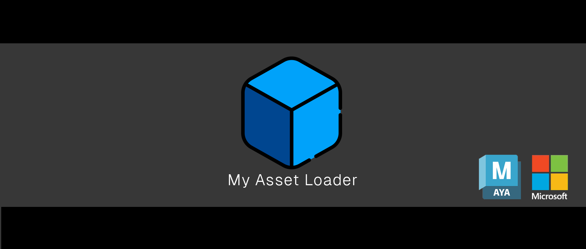

# **Asset Loader (Windows/Maya)**



## Status
My Asset Loader is in active development. Features are being refined to create a production-ready asset browser that's significantly simpler and more intuitive than existing solutions.


## Introduction
My Asset Loader simplifies asset management in Maya. Unlike the complex rig loader, this tool provides an **intuitive file browser interface** for finding, previewing, and loading assets quickly. Instead of manually shifting through project folders, browse all subfolders and locate relevant assets in seconds.

gi
## Environment
- [x] **OS**: Windows
- [x] **Software**: Maya


## App Features
1. **Smart Asset Browser**
    - [x] Browse all project subfolders in a Windows-explorer-like interface
    - [x] Instantly locate published and unpublished assets
    - [x] Search-friendly folder navigation without manual path hunting

    

2. **Rich Media Preview**
    - [x] Preview images and videos before loading
    - [x] Verify asset content at a glance
    - [x] Reduce load errors and wasted time

    


3. **Easy Asset Loading**
    - [x] Load required asset versions into your Maya scene


## Quick Start

### In Maya
```python
import my_asset_loader
my_asset_loader.run()
```

### Standalone (Windows)
Run the batch file to launch as a standalone application:
```bash
exe/windows/my_asset_loader.bat
```

## License

This project is licensed under the Apache License 2.0. See the LICENSE file at the repository root.
